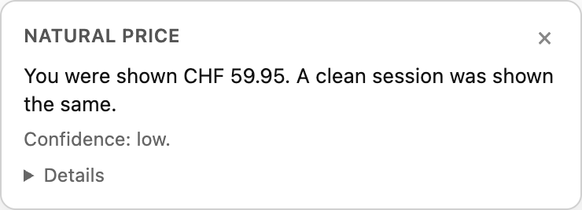
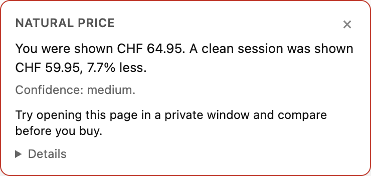

# Natural Price

**See the price a stranger would get, next to the price you were shown.**

Natural Price is an open-source browser extension that detects personalised
pricing. When you open a product page it reads the price you see, opens the
same page again in a private tab on your own device, and shows you the
difference. By default nothing leaves your browser. Later, anonymous reports from many users give a second,
harder-to-block baseline: what other people saw for the same product in the
same hour.

[](https://github.com/Tumub/natural-price/actions/workflows/ci.yml)

Status: **deployed, private beta open**. Production fetch service and
crowd API run at `the deployed service`; release zips for Chrome and Firefox are
on the [releases page](https://github.com/Tumub/natural-price/releases). Extension,
clean-room fetch service, comparison rules and the crowd baseline work end
to end on three launch sites (IKEA, MediaMarkt, Nike, Swiss storefronts),
Not yet in any store. Read [PLAN.md](PLAN.md) for the roadmap and the
open issues for what to pick up.

<p>
  
  
</p>

Both are real end-to-end results against a locally served copy of the IKEA
page. On the right the tab was shown an inflated price and the clean fetch
read the genuine one.

## Try it

```bash
git clone https://github.com/Tumub/natural-price && cd natural-price
npm install
npx playwright install chromium
npm test
```

Run the crowd API and the fetch service in two terminals:

```bash
NP_CROWD_SECRET=$(openssl rand -hex 32) npm run crowd
```

```bash
NP_ALLOWED_HOSTS=ikea.com,mediamarkt.ch,nike.com,booking.com NP_CROWD_URL=http://localhost:8788 npm run service
```

Build the extension and load it:

```bash
npm run build:extension
```

Open `chrome://extensions`, enable Developer mode, choose "Load unpacked"
and pick `packages/extension/dist`. Then open a product page on one of the
three sites. The badge appears bottom right within a few seconds.

Firefox: `npm run build:extension:firefox`, then `about:debugging`, "Load
Temporary Add-on", pick `packages/extension/dist-firefox/manifest.json`.

Or just look at what the extractor sees on one page:

```bash
npm run demo -- https://www.ikea.com/ch/en/p/billy-bookcase-white-00263850/
```

The last command fetches one page anonymously and prints what the extractor
sees. On 2026-09-10 it printed:

```json
{
  "productKey": "002.638.50",
  "productKeyType": "sku",
  "price": 59.95,
  "currency": "CHF",
  "url": "https://www.ikea.com/ch/en/p/billy-bookcase-white-00263850/",
  "observedAt": "2026-09-10T07:35:53.174Z",
  "source": "jsonld",
  "extractor": "jsonld",
  "name": "BILLY Bookcase - white 80x28x202 cm",
  "country": "CH"
}
```

That is the whole idea in one object: what was shown, where, when, in what
currency, for which destination. Everything else compares two of these.

## Why

- Retailers, airlines and hotel platforms personalise prices using your
  cookies, login, device and history. You cannot see it happening.
- The EU already requires traders to disclose a price that was personalised
  through automated decision-making (Consumer Rights Directive, Article
  6(1)(ea), in force since May 2022). Almost nobody discloses visibly.
- The EU Digital Fairness Act, expected to be proposed in late 2026, puts
  personalised pricing squarely in scope. Enforcement will need evidence.
- A crowd-sourced extension found 10 to 30 percent variation across
  retailers back in 2013 ([Mikians et al.](https://arxiv.org/abs/1307.4531)).
  Nobody has kept that tool alive.

## How it works

```
 your browser                       natural-price backend
 ┌─────────────────────┐            ┌──────────────────────────┐
 │ extension           │  url +     │ fetch-service            │
 │  reads price        │  price ───▶│  loads url in a clean    │
 │  (JSON-LD, DOM)     │            │  headless session, from  │
 │  shows badge        │◀── baseline│  several locations       │
 └─────────────────────┘            ├──────────────────────────┤
           │ anonymous              │ crowd-api  (phase 4)     │
           │ observation ──────────▶│  median of what others   │
           └────────────────────────│  saw, same window        │
                                    └──────────────────────────┘
```

When enough other users have seen the same product, the badge adds what
they saw: "5 other people saw a median of CHF 840.90 this hour." A clean
fetch that the crowd confirms is high confidence. When a site blocks every
clean session, the crowd median is the fallback.

The clean session can also run on your own device: a private tab with no
cookies or login, opened and closed by the extension. Choose server, private
tab, or both in the options. The private tab uses your own address, so shops
cannot block it, but it cannot see location or device effects; the server
can, and some shops block it. Both together give medium confidence.

Two baselines, because each fails differently:

| Baseline | Strength | Weakness |
|---|---|---|
| Clean-room fetch | Works from day one, no user base needed | Retailers fingerprint and block headless browsers |
| Crowd comparison | Cannot be blocked, matches real sessions | Useless until enough users report the same products |

## What this is not

- **Not a price shield.** Chrome Manifest V3 does not let an extension
  rewrite your requests dynamically, and an anonymous session is often not
  the cheaper one anyway. Natural Price tells you when a lower price exists
  and how to get it. It does not pretend to make you invisible.
- **Not a scraper.** The fetch service loads one page per user request. Bulk
  crawling is out of scope and against the spirit of the project. Respect
  the terms of service of the sites you use.
- **Not a tracker.** See [PRIVACY.md](PRIVACY.md) for exactly what leaves
  your browser. Nothing identifies you.

## Repository layout

```
packages/extension/      browser extension (Manifest V3, Chrome and Firefox), extractors, fixtures
packages/fetch-service/  clean-room fetch API (Playwright), comparison rules, stats
packages/crowd-api/      anonymous observation store, aggregation, open-data export
packages/shared/         rate limiter, payload validation, HTTP helpers
docs/                    launch sites, comparison rules, payload schema, blocking log, open data
docs/beta/               tester install, feedback, recruiting, weekly summary
docs/store/              Chrome Web Store and Firefox AMO listing copy
test-support/            local fixture server used by the end-to-end tests
```

## Contributing

The easiest and most valuable contribution is a site extractor: one file,
one saved HTML fixture, one test. See [CONTRIBUTING.md](CONTRIBUTING.md).

## Licence

AGPL-3.0. You can fork, modify and self-host. If you run a modified version
as a service, you must publish your changes. This is deliberate: the value of
the crowd data depends on nobody quietly forking the backend and hoarding it.
See [LICENSE](LICENSE).
